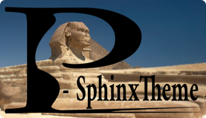

=============
Documentation
=============

This is release |release| of a Python package named :mod:`!PSphinxTheme`.
*P-Sphinx Theme* stands for *Projects-Sphinx Theme*.

It contains a main `Sphinx <http://sphinx-doc.org/>`_ theme named "p-cloud", and some related Sphinx extensions.
*P-Sphinx Theme* and its extensions are primarily oriented towards generating html documentation for Python libraries using
`Python 3`.
It provides numerous small enhancements to make the *html documentation* more interactive, improve the layout on mobile
devices, and others.

Acknowledgements
================
Most parts of ``P-Sphinx Theme's`` code and documentation originate from
**Eli Collins's** excellent `cloud_sptheme <https://bitbucket.org/ecollins/cloud_sptheme>`_ v1.6.

THANKS

Main changes
------------
To fit my own projects.

- renamed
- reformatted (3 space indentation, 125 char lines)
- some fixes
- removed python2 related parts
- changes and additions

.. seealso:: :doc:`Changelog <history>`

Contents
========

Themes
------

**main-cloud:** :doc:`P-Sphinx Main Theme <main_cloud_theme>` the main Sphinx theme provided by this package.

.. index:: sphinx theme; p-greencloud

**p-greencloud:** a derivation of the `main-cloud theme`

.. index:: sphinx theme; p-redcloud

**p-redcloud:** a derivation of the `main-cloud theme` used for this documentation

Extensions
----------
The following Sphinx extensions provide features used by the *P-SphinxTheme*:

   :mod:`PSphinxTheme.ext.index_styling`
      Adds additional css styling classes to the index page.

   :mod:`PSphinxTheme.ext.relbar_links`
      Adds any link to the top/bottom navigation bar.

   :mod:`PSphinxTheme.ext.psphinx_admonitions`
      A collection of all *official P-SphinxTheme admonitions*

   :mod:`PSphinxTheme.ext.sidebarlogo_perpag`
      PSphinxTheme.ext.sidebarlogo_perpag - override sphinx sidebar logo per-page

This package also provides a few extra Sphinx extensions which may be useful when documenting Python projects:

   :mod:`PSphinxTheme.ext.issue_tracker`
      Adds a special ``:issue:`` role for quickly linking to your project's issue tracker.

   :mod:`PSphinxTheme.ext.escaped_samp_literals`
      Patches Sphinx to permit escaped ``{}`` characters within a ``:samp:`` role.

   :mod:`PSphinxTheme.ext.table_styling`
      Enhances ``.. table`` directive to support per-column text alignment and other layout features.

Reference
---------
:doc:`install`
   requirements and installations instructions

:doc:`history`
   history of current and past releases

Examples
--------
:doc:`theme_test`
   main display of various features of the *P-Sphinx Theme*

Online Resources
================

.. rst-class:: html-plain-table

   ====================== ===============================================
   Homepage:              `<https://github.com/peter1000/PSphinxTheme>`_
   Online Docs:           `<http://packages.python.org/PSphinxTheme>`_
   Download & PyPI:       `<http://pypi.python.org/pypi/PSphinxTheme>`_
   ====================== ===============================================

Related Resources
-----------------

.. rst-class:: html-plain-table

   =================== ==================================================== ================================================
   LconfPygmentsLexer: `<https://github.com/peter1000/LconfPygmentsLexer>`_ a simple pygments lexer for LCONF
   =================== ==================================================== ================================================

Projects using PSphinxTheme
===========================

Known `projects` which make use of: **PSphinxTheme**

- `PySpeedIT <https://github.com/peter1000/PySpeedIT>`_
   A collection of: Benchmark-IT, Profile-IT, Line-Memory-Profile-IT, Disassemble-IT.

- `LCONF <https://github.com/peter1000/LCONF>`_
   L(ight) CONF(iguration): A light - human-friendly, simple readable data serialization format for dynamic configuration.

- `JqPyCharts <https://github.com/peter1000/JqPyCharts>`_
   `JqPyCharts` is a selection of: Javascripts / Css for simple charts in python projects.

- `HealthNutritionPlanner <https://github.com/peter1000/HealthNutritionPlanner>`_
   Plan: weight loss, healthy diets, meals.
